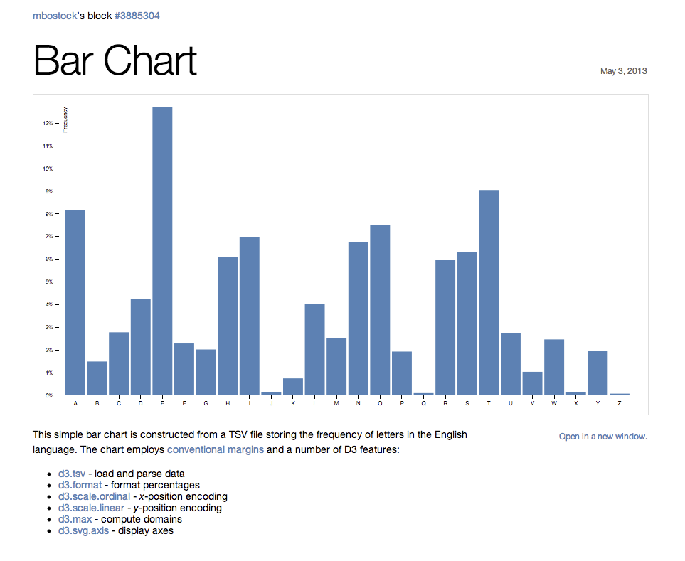

# Programmeerproject
Minor programmeren UvA 
Lonneke Lammers
10371672

# Proposal: Datavisualisatie Baanperspectieven 

Mijn voorstel is om tijdens het programmeerproject een datavisualisatie te maken van soorten banen en de werkgelegenheidsperspectieven hiervan. Hierbij wil ik de verschillende banen op alfabetische volgorde van links naar rechts in een barchart weergeven, met een  interactive functie dat wanneer je klikt op een chart/banensector, er een tooltip tevoorschijn komt met meer informatie. 

(Een deel van) de volgende informatie wil ik zichtbaar maken in de visualisatie:
- employment in 2014
- employment change
- job openings 2014-2024
- 2014 median annual wage
- work experience in a related occupation
- typical on-the-job training
- typical entry-level education

// DATA 

De data ben ik van plan te scrapen vanaf: http://data.bls.gov/projections/occupationProj 
Dit is data afkomstig van een Amerikaanse Databank: U.S. Bureau of Labor Statistics. Omdat dit een zeer uitgebreide Databank is en ik op het cbs geen goed vergelijkbare Nederlandse versie kan vinden gebruik ik deze data.

Ik zal de data om moeten zetten in een goed leesbaar csv bestand, en dit vervolgens verwerken in javascript + d3 in html. 

// DOELGROEP

Mijn idee om hier een visualisatie van te maken is ontstaan uit het feit dat veel middelbare scholieren moeite hebben met hun studiekeuze. Deze visualisatie kan hen helpen inzicht te verschaffen over baanperspectieven in de komende tien jaar en wellicht hun keuze zo (deels) te baseren op deze data. 

// POTENTIELE PROBLEMEN

Het zou moeilijk kunnen worden alle bovenstaande data toe te voegen in mijn visualisatie. Daarom zal wellicht niet alle data uit mijn dataset gebruikt worden, maar in ieder geval twee om een interactie mogelijk te maken. 
Ook ontbreekt er hier en daar wat data in de dataset. Dit zal duidelijk weergeven moeten worden aan de gebruiker. 

// VOORBEELD

Onderstaand een voorbeeld van een barchart. De barchart geeft de employment van 2014 weer. Verder wil ik hier de mogelijkheid aan toevoegen dat je klikt op een van de baansectoren, en zo een klein tekstvak krijgt met hier informatie over die bepaalde baan/sector. Bijvoorbeeld het gemiddelde inkomen en de employment change. 

